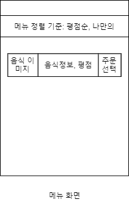
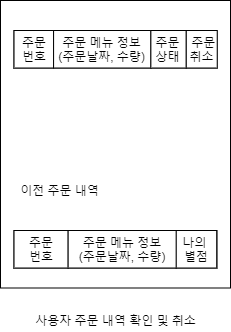
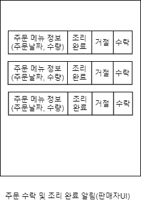
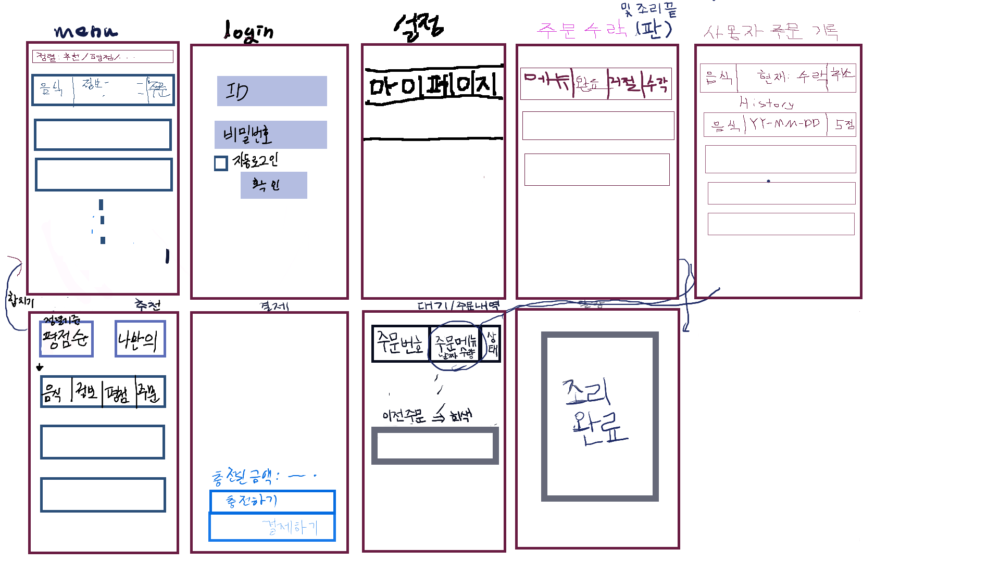

## System Requirements

---

### Functional Reqs

| Identifier | User Story                                                                                             | Size |
| ---------- | ------------------------------------------------------------------------------------------------------ | ---- |
| Req-1      | 구매자는 화면에서 현재 주문 가능한 음식들을 확인하고 선택하여 주문할 수 있다.                          | 4    |
| Req-2      | 구매자는 주문 메뉴의 상태(주문 수락 여부, 조리 완료 여부 등)를 확인할 수 있다.                         | 3    |
| Req-3      | 구매자는 주문 후 자신이 충전해둔 금액을 활용하여 결제를 진행할 수 있다.                                | 3    |
| Req-4      | 구매자는 다 먹은 후 자신이 먹은 음식에 대한 평가를 별점을 통해 할 수 있다.                             | 3    |
| Req-5      | 구매자는 자신의 잔액과, 주문 기록 등을 확인할 수 있다.                                                 | 3    |
| Req-6      | 구매자는 자신의 상황에 따라 설정된 주문 취소 제한 시간 안에 주문을 취소할 수 있다.                     | 3    |
| Req-7      | 구매자는 아이디를 활용하여 로그인할 수 있다.                                                           | 4    |
| Req-8      | 판매자는 고객이 주문한 내역을 확인할 수 있다.                                                          | 4    |
| Req-9      | 판매자는 고객에게 주문의 수락 혹은 거절을 할 수 있다. 다만 주문 거절시에는 이유를 고객에게 밝혀야한다. | 3    |
| Req-10     | 판매자는 고객이 주문한 메뉴를 찾아가게 되면 주문이 완료되었음을 기록할 수 있다.                        | 3    |
| Req-11     | 판매자는 메뉴를 추가, 삭제할 수 있다.                                                                  | 3    |
| Req-12     | 판매자는 아이디를 활용하여 로그인할 수 있다.                                                           | 2    |
| Req-13     | 구매자는 맛있는 음식을 먹기 위해 다른 사람의 평가를 참조할 수 있다.                                    | 3    |
| Req-14     | 구매자는 자신의 주문 패턴과 유사한 음식을 추천받을 수 있다.                                            | 6    |
| Req-15     | 구매자는 다른 고객들에게 좋은 평가를 받은 메뉴를 추천받을 수 있다.                                     | 6    |

 

### Non functional Reqs

| Identifier | Reqs                                                                                        |
| ---------- | ------------------------------------------------------------------------------------------- |
| NFR1       | 시스템은 어느 환경에서도 어플을 사용할 수 있어야한다.                                       |
| NFR2       | 직관적인 UI를 통해 사용자가 주문, 결제, 주문완료의 과정을 어려움 없이 진행할 수 있어야한다. |
| NFR3       | 구매자와 판매자의 아이디 정보는 안전하게 보관되어야 한다.                                   |
| NFR4       | 시스템은 구매자, 판매자의 개입을 최소화해야 한다.                                           |
| NFR5       | 구매자는 주의를 환기시키는 적절한 알람 소리를 통해 주문 상태에 대한 알림을 받을 수 있다.    |
| NFR6       | 구매자는 한 번 로그인을 하면 로그아웃을 하지 않는 이상 로그인이 유지된다.                   |

 

  

